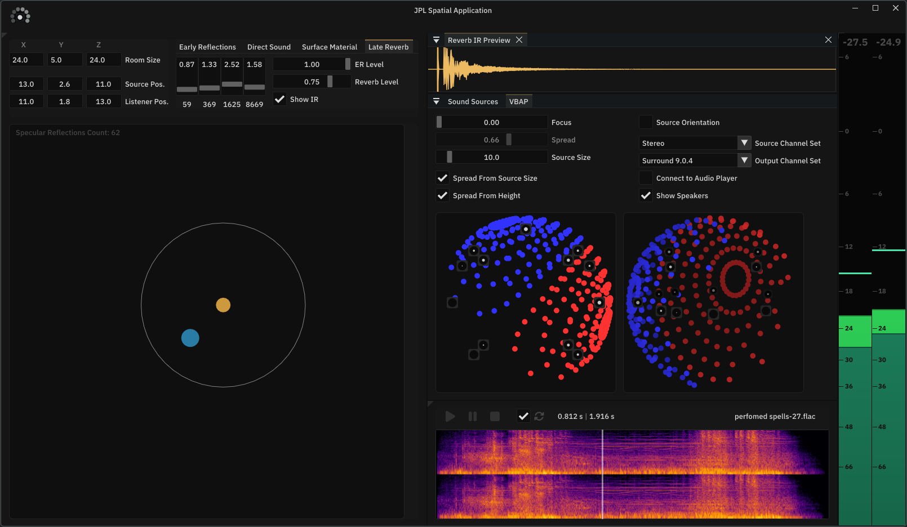

# JPL Spatial Application

Application demonstrating some of the capabilities of [JPL Spatial](https://github.com/Jaytheway/JPLSpatial/).

The GUI is drawn using [Dear ImGui](https://github.com/ocornut/imgui) library with custom framework on top.

## JPL Spatial Features
- **Direct Sound** (DS) Propagation & Spatialization
- **Ray Traced Early** (*Specular*) **Reflections** (ERs)
- **Late Reverberation** based on room size, volume, materials and **Air Absorption**
---
- Pannign of **Direct Sound** source is handled by **MDAP** (multiple directions)
- **Early Reflections** are traced using **Image Source** method and panned by **VBAP** (single directoin per ER)
- **Late Reverberation** is rendered by **Filter Delay Network** (FDN) **Reverb** with **4-band Crossover Decay Filters**
- Propagation delay for both, DS and ERs, is rendered by **Interpolating Delay Lines**
- Propagation filtering (ER *surface absorption*, DS/ER *air absorption*) is processed by **4-band Crossover Filters**
- *Inverse law* distance attenuation is applied to both DS and ERs

## JPL Spatial Application Features
### VBAP/MDAP Visualization

**Direct Sound** source's MDAP has *"all"* the expected parameters exposed to **GUI**:
- **Focus** - contract direction vectors towards source the channel directions
- **Spread** - contract all the direction vectors toward the source pan direction
- **Source Size** - if **Spread From Source Size** is enabeld, the size of the source is used to compute **Spread** based on distance from the listener
- **Spread From Height** - as the source gets closer to *"directly above"* or *"directly below"*, spread minimum value goes towards 1.0 (100%)
- **Source Orientation** - whether to use source orientation for spatialization or not
	- when source orientation **IS used**, the source becomes more like a sound field in the world space
	- when source orientaion is **NOT used**, the source's frame is rotated towards the listener

> [!TIP]
> *Source* and *Output* **Channel Configuration** can be disconnnected form the playing audio to visualize panning for configurations that may not be available on the user's device.

### Sound Source Playback
- **Sound Source** can be selected in the **"Sound Sources"** tab/window
	- a few audio files are available in the repository (and in the release)
	- *sound source directory* can be selected to play different files
- **Audio Player** has and all the expected playback controlls
- **Audio Preview** attached to **Audio Player** to visualize source audio as *spectrogram* or *waveform*
- **Loudness Meter** displays *Peak* and *RMS* loundess of the application output; the big number at the top displays current *RMS* value

> [!TIP]
> You can change display mode of **Audio Preview** in the *Right-Click* context menu, which can also be opened by clicking the settigns button that apperas on hover.

### Room / Environment Parameters

**Room** *(everything is in 3 dimensions)*:
- Room size
- Source position
- Listener position

**Early Reflections** (aka **Specular Reflections**, not that *early* at high order):
- **Number of Primary Rays** - mainly needed to balance performace vs source detection possiblility *(for a simple shoe-box room, its 6 surfaces can easily be detected with a small number of rays)*
- **Max Reflection Order** - maximum allowed reflection order to trace

**Direct Sound**
- Options to Enable/Disable: **Air Absorpiton**, **Distance Attenuation**, **Propagation Delay** (also responsible for *doppler effect*)

**Surface Material**

- Changes material absorption applied to reflected ER paths, as well as estimation of *Reverberation Time*.
- Sliders display absorption coefficients of the currently selected material in 4 frequency bands
- **Custom Material** can be selected from the list, which enables manual adjustment of the coefficient sliders

**Late Reverb**:
- **Reverberation Time** (RT60) in 4 frequency bands reflects the last estimation based on **Room** parameters, can also be manually set by adjusting corresponding sliders
- **ER Level** controls the level of **Early Reflections** that goes to the main output
- **Reverb Level** controll the level of the **Late Reverb** that goes to the main output
- **Show IR** button opens up **Audio Preview** of the reverb *Impulse Response*

> [!TIP]
>**Spatialziation Effects** can be enabled/disabled individually for the **Direct Sound** to hear the effect with/without them.
>
>**Specular Reflections** and **Direct Sound** can also be muted individually.

> [!NOTE]
> **Routing**  
> - **Direct Sound** is routed to **Early Reflections**
> - **Early Reflections** are routed to **Late Reverb** after all the propagation attenuations (*distance*, *air absorption*, *material absorption* etc.)
>
> If **ERs** are disabled, **Late Reverb** will also be silent.

## Supported platforms
- Currently Windows only
- Other platforms may or may not work

## Building
- To build the application, run appropriate build script in `build` folder, open generated Visual Studio solution and compile relevant configuration.
- To directly build the executable in Distribution config, run `...build_distribution.bat`. The executable is going to be in `[repo root]/bin/Distribution-windows-x64/JPLSpatialApplication/` folder. Note: only the contents of `JPLSpatialApplication` folder is needed to run the application, other build artifacts in `Distribution-windows-x64` can be ignored.
- Uses C++20

## Dependencies
- [JPL Spatial](https://github.com/Jaytheway/JPLSpatial/) - sound spatialization and propagaion - [ISC license](https://github.com/Jaytheway/JPLSpatial/blob/main/LICENSE)
- [MiniaudioCpp](https://github.com/Jaytheway/JPLSpatial/) - routing and rendering audio to endpoint device - [ISC license](https://github.com/Jaytheway/MiniaudioCpp/blob/main/LICENSE)
- [Walnut (CMake fork)](https://github.com/Jaytheway/WalnutCMake) - platfom window handling and some application utilities - [MIT license](https://github.com/Jaytheway/WalnutCMake/blob/master/LICENSE.txt)

## License
The project is distributed under the [ISC license](LICENSE).

### Third-Party Assets
**JPL Spatial Application** uses the following fonts:
- [IBM Plex Sans](https://fonts.google.com/specimen/IBM+Plex+Sans) licensed under the [SIL Open Font License 1.1](licenses/OFL.txt).
  Copyright (c) 2017 IBM Corp. with Reserved Font Name "IBM Plex".
- [Cascadia Code](https://github.com/microsoft/cascadia-code) licensed under the [SIL Open Font License 1.1](licenses/OFL.txt). Copyright (c) 2019 - Present, Microsoft Corporation,
with Reserved Font Name Cascadia Code.
- A few icons are used from [Font Awesome (free)](https://github.com/FortAwesome/Font-Awesome) under the [SIL Open Font License 1.1](licenses/OFL.txt).
  
